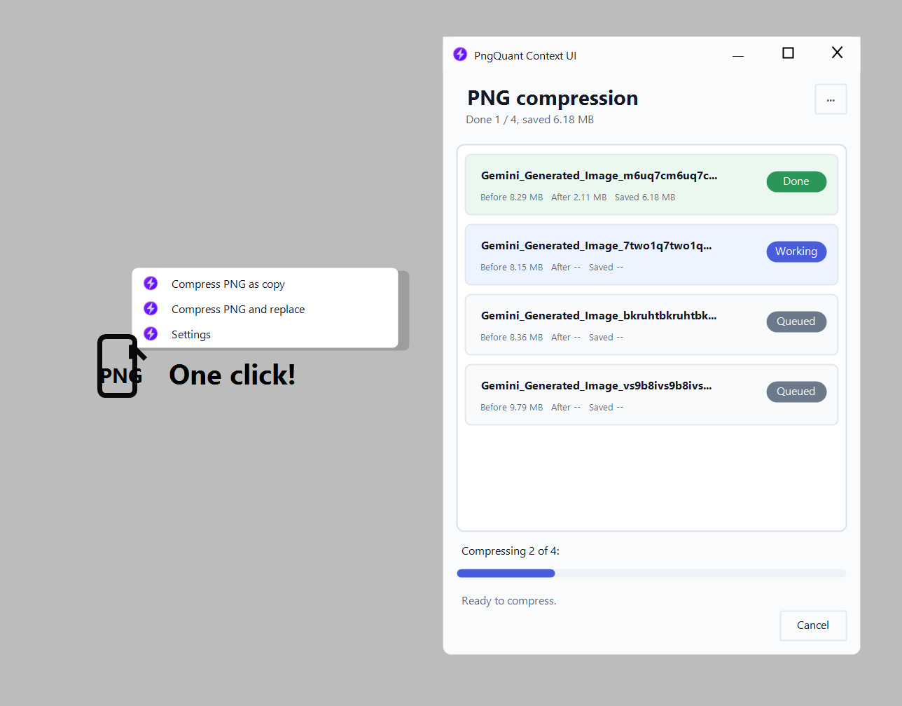

# PngQuant Context UI

Компактное UI-расширение для классического контекстного меню Windows 11, которое сжимает PNG-файлы через `pngquant`.

Проект не является отдельным PNG-компрессором. Это оболочка для `pngquant`: сначала установите `pngquant.exe`, положите его рядом с приложением или разрешите приложению скачать официальный Windows-бинарник при первом запуске.



## Навигация

- [Возможности](#возможности)
- [Контекстное меню](#контекстное-меню)
- [Интерфейс](#интерфейс)
- [Требования и совместимость](#требования-и-совместимость)
- [Сборка](#сборка)
- [Установка](#установка)
- [Удаление](#удаление)
- [Реестр вручную](#реестр-вручную)
- [Поддержать проект](#поддержать-проект)
- [Ссылки](#ссылки)
- [Примечания](#примечания)

## Возможности

- Один каскадный пункт в контекстном меню Explorer.
- Быстрое сжатие PNG как копии или с заменой оригинала.
- Автоматическое объединение нескольких запусков Windows в одно batch-окно.
- Очередь файлов с размером до/после, экономией и статусом.
- Кнопка остановки текущего `pngquant`-процесса.
- Светлая и темная тема.
- Настройки в компактном меню `...`.
- Встроенный flow установки `pngquant`, если он отсутствует.

[Наверх](#pngquant-context-ui)

## Контекстное меню

Приложение добавляет один пункт:

```text
Compress PNG
```

Внутри него находятся команды:

- `Compress PNG as copy`
- `Compress PNG and replace`
- `Settings`

Первые две команды сразу запускают сжатие с пресетом `Balanced`. Команда `Settings` открывает окно без автостарта, чтобы можно было поменять режим, preset, dithering и тему.

Если выбрано несколько PNG-файлов, Windows может запустить команду отдельно для каждого файла. Приложение собирает эти запуски в одну очередь автоматически.

[Наверх](#pngquant-context-ui)

## Интерфейс

Главное окно специально сделано небольшим, потому что приложение обычно запускается из Explorer. В нем показаны:

- список файлов;
- статус каждого файла;
- размер до и после сжатия;
- сколько удалось сохранить;
- общий прогресс по очереди;
- `Cancel` во время выполнения.

Настройки открываются через кнопку `...`:

- режим `Copy` или `Replace`;
- preset `Balanced`, `Quality` или `Fast`;
- переключатель `No dithering`;
- тема `Light` или `Dark`;
- `About` с версией и ссылкой на GitHub.

`pngquant` не отдает процент выполнения внутри одного файла, поэтому приложение не рисует фейковый per-file progress. Прогрессбар показывает завершенные файлы в очереди.

[Наверх](#pngquant-context-ui)

## Требования и совместимость

- Рекомендуемая и проверенная среда: Windows 11 с классическим/legacy контекстным меню Explorer.
- Другие версии Windows и сторонние shell-расширения не проверялись.
- `.NET Framework 4.x`.
- `pngquant.exe` рядом с приложением:
  - `pngquant.exe`
  - `pngquant\pngquant.exe`

Если `pngquant.exe` не найден, приложение не показывает жесткую ошибку. Вместо этого оно предлагает скачать официальный архив Windows с <https://pngquant.org/pngquant-windows.zip>.

`pngquant` распространяется отдельно от этой UI-оболочки. Для публичных релизов включайте `pngquant.exe` в архив только если условия его лицензии это позволяют.

[Наверх](#pngquant-context-ui)

## Сборка

Запуск из PowerShell:

```powershell
.\scripts\build.ps1
```

Результат:

```text
dist\PngQuantContext.exe
```

Сборка с копированием локального `pngquant.exe` в `dist`:

```powershell
.\scripts\build.ps1 -PngQuantPath "C:\Tools\pngquant\pngquant.exe"
```

[Наверх](#pngquant-context-ui)

## Установка

```powershell
.\scripts\install.ps1
```

Если `dist\pngquant\pngquant.exe` отсутствует, можно передать путь к локальному `pngquant.exe`:

```powershell
.\scripts\install.ps1 -PngQuantPath "C:\Tools\pngquant\pngquant.exe"
```

Путь установки по умолчанию:

```text
%LOCALAPPDATA%\PngQuantContext
```

Installer пишет только в `HKCU`, поэтому права администратора не нужны.

[Наверх](#pngquant-context-ui)

## Удаление

```powershell
.\scripts\uninstall.ps1
```

[Наверх](#pngquant-context-ui)

## Реестр вручную

Installer создает меню на уровне ассоциации `.png`, независимо от текущего приложения просмотра PNG:

```text
HKCU\Software\Classes\SystemFileAssociations\.png\shell\PngQuantContext
```

Команды находятся здесь:

```text
HKCU\Software\Classes\SystemFileAssociations\.png\shell\PngQuantContext\Shell
```

Иконка контекстного меню указывает на установленный файл:

```text
%LOCALAPPDATA%\PngQuantContext\PngQuantContext.ico
```

Если Explorer продолжает показывать старую иконку, перезапустите Explorer или сбросьте icon cache Windows. Это кэш оболочки, а не ошибка регистрации меню.

[Наверх](#pngquant-context-ui)

## Поддержать проект

Если проект оказался полезен, можно поддержать разработку:

| Валюта | Адрес |
| --- | --- |
| Bitcoin | `bc1pfuhstqcwwzmx4y9jx227vxcamldyx233tuwjy639fyspdrug9jjqer6aqe` |
| Ethereum | `0x9c7ee1199f3fe431e45d9b1ea26c136bd79d8b54` |
| TON | `UQBpZGp55xrezubdsUwuhLFvyqy6gldeo-h22OkDk006e1CL` |
| BNB | `0x9c7ee1199f3fe431e45d9b1ea26c136bd79d8b54` |
| Solana | `HXjHPdJXyyddd7KAVrmDg4o8pRL8duVRMCJJF2xU8JbK` |

[Наверх](#pngquant-context-ui)

## Ссылки

- GitHub проекта: <https://github.com/mainiken/pngquant-context-ui>
- Официальный сайт `pngquant`: <https://pngquant.org/>
- Архив `pngquant` для Windows: <https://pngquant.org/pngquant-windows.zip>
- Telegram-канал: <https://t.me/+vpXdTJ_S3mo0ZjIy>

[Наверх](#pngquant-context-ui)

## Примечания

- Ошибки сжатия пишутся в `PngQuantContext.log` рядом с приложением.
- Режим `Copy` создает `image-compressed.png` рядом с `image.png`.
- Режим `Replace` перезаписывает исходный файл.

[Наверх](#pngquant-context-ui)
