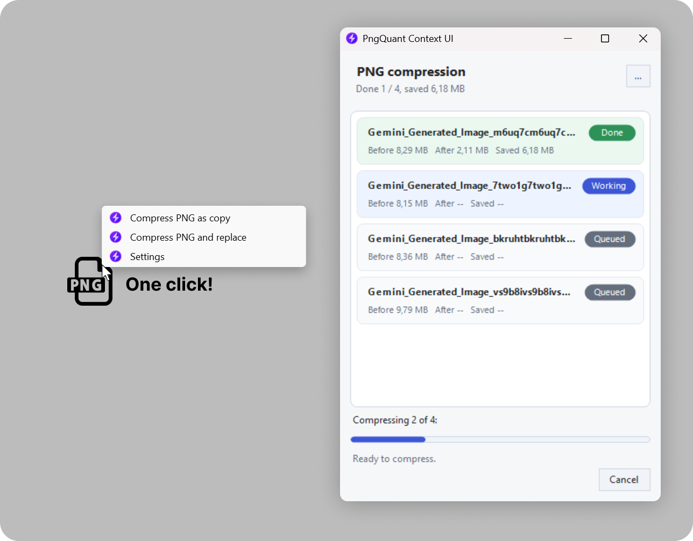

# PngQuant Context UI

**🇬🇧 English** | [🇷🇺 Русский](README_RU.md)

Compact UI extension for the classic Windows 11 Explorer context menu. It compresses PNG files through `pngquant` without opening the full Pngyu application.

This project is not a standalone PNG compressor. It is a small shell/UI wrapper for `pngquant`: install `pngquant.exe` first, place it next to the app, or let the app download the official Windows binary on first launch.



## Table of Contents

- [Features](#features)
- [Context Menu](#context-menu)
- [Interface](#interface)
- [Requirements and Compatibility](#requirements-and-compatibility)
- [Build](#build)
- [Install](#install)
- [Uninstall](#uninstall)
- [Manual Registry Notes](#manual-registry-notes)
- [Support and Donations](#support-and-donations)
- [Links](#links)
- [Notes](#notes)

## Features

- One cascading Explorer context menu item.
- Fast PNG compression as a copy or with original file replacement.
- Automatic merge of multiple Explorer launches into one batch window.
- File queue with before/after size, saved bytes, and status.
- Cancel button for the current `pngquant` process.
- Light and dark theme.
- Compact settings menu under the `...` button.
- Built-in setup flow when `pngquant` is missing.

[Back to top](#pngquant-context-ui)

## Context Menu

The app adds one Explorer menu item:

```text
Compress PNG
```

It contains three commands:

- `Compress PNG as copy`
- `Compress PNG and replace`
- `Settings`

The first two commands start compression immediately with the `Balanced` preset. `Settings` opens the app without auto-start so the user can change mode, preset, dithering, and theme.

When several PNG files are selected, Windows may start the command once per file. The app collects those launches into one shared queue automatically.

[Back to top](#pngquant-context-ui)

## Interface

The main window is intentionally compact because the app is normally launched from Explorer. It shows:

- file list;
- status for each file;
- size before and after compression;
- saved size;
- total queue progress;
- `Cancel` while compression is running.

Settings are available from the `...` button:

- mode: `Copy` or `Replace`;
- preset: `Balanced`, `Quality`, or `Fast`;
- `No dithering` toggle;
- theme: `Light` or `Dark`;
- `About` with version and GitHub link.

`pngquant` does not report percentage progress for a single file, so the app does not fake per-file progress. The progress bar shows completed files in the queue.

[Back to top](#pngquant-context-ui)

## Requirements and Compatibility

- Recommended and tested environment: Windows 11 with the classic/legacy Explorer context menu.
- Other Windows versions and third-party shell extensions have not been tested.
- `.NET Framework 4.x`.
- `pngquant.exe` next to the app:
  - `pngquant.exe`
  - `pngquant\pngquant.exe`

If `pngquant.exe` is not found, the app does not show a hard error. Instead, it offers to download the official Windows archive from <https://pngquant.org/pngquant-windows.zip>.

`pngquant` is distributed separately from this UI wrapper. Include `pngquant.exe` in public builds only when its license allows it.

[Back to top](#pngquant-context-ui)

## Build

Run from PowerShell:

```powershell
.\scripts\build.ps1
```

Build output:

```text
dist\PngQuantContext.exe
```

Build and copy a local `pngquant.exe` into `dist`:

```powershell
.\scripts\build.ps1 -PngQuantPath "C:\Tools\pngquant\pngquant.exe"
```

[Back to top](#pngquant-context-ui)

## Install

```powershell
.\scripts\install.ps1
```

If `dist\pngquant\pngquant.exe` is missing, pass a local `pngquant.exe` path:

```powershell
.\scripts\install.ps1 -PngQuantPath "C:\Tools\pngquant\pngquant.exe"
```

Default install path:

```text
%LOCALAPPDATA%\PngQuantContext
```

The installer writes only to `HKCU`, so administrator rights are not required.

[Back to top](#pngquant-context-ui)

## Uninstall

```powershell
.\scripts\uninstall.ps1
```

[Back to top](#pngquant-context-ui)

## Manual Registry Notes

The installer registers the menu at the `.png` association level, independent of the current PNG viewer:

```text
HKCU\Software\Classes\SystemFileAssociations\.png\shell\PngQuantContext
```

Menu commands are stored here:

```text
HKCU\Software\Classes\SystemFileAssociations\.png\shell\PngQuantContext\Shell
```

The context menu icon points to the installed icon file:

```text
%LOCALAPPDATA%\PngQuantContext\PngQuantContext.ico
```

If Explorer still shows the old icon, restart Explorer or reset the Windows icon cache. That is Explorer cache behavior, not a menu registration error.

[Back to top](#pngquant-context-ui)

## Support and Donations

If this project is useful to you, you can support development:

| Currency | Address |
| --- | --- |
| Bitcoin | `bc1pfuhstqcwwzmx4y9jx227vxcamldyx233tuwjy639fyspdrug9jjqer6aqe` |
| Ethereum | `0x9c7ee1199f3fe431e45d9b1ea26c136bd79d8b54` |
| TON | `UQBpZGp55xrezubdsUwuhLFvyqy6gldeo-h22OkDk006e1CL` |
| BNB | `0x9c7ee1199f3fe431e45d9b1ea26c136bd79d8b54` |
| Solana | `HXjHPdJXyyddd7KAVrmDg4o8pRL8duVRMCJJF2xU8JbK` |

[Back to top](#pngquant-context-ui)

## Links

- Project GitHub: <https://github.com/mainiken/pngquant-context-ui>
- Official `pngquant` website: <https://pngquant.org/>
- Windows `pngquant` archive: <https://pngquant.org/pngquant-windows.zip>
- Telegram channel: <https://t.me/+vpXdTJ_S3mo0ZjIy>

[Back to top](#pngquant-context-ui)

## Notes

- Compression errors are written to `PngQuantContext.log` next to the app.
- `Copy` mode creates `image-compressed.png` next to `image.png`.
- `Replace` mode overwrites the source file.

[Back to top](#pngquant-context-ui)
